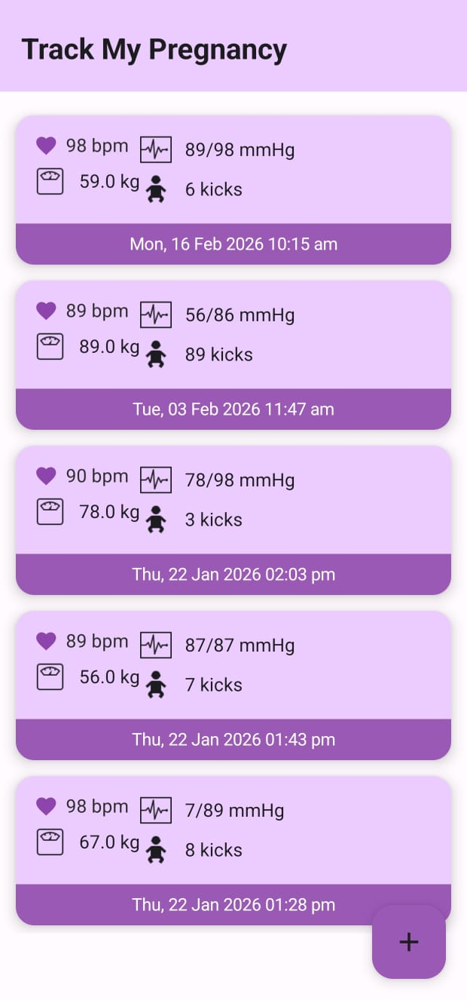
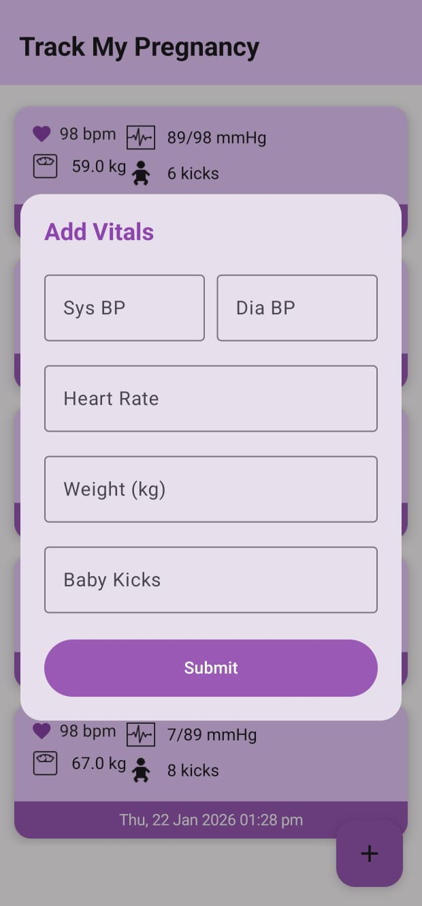

# Pregnancy Tracker

An Android application built in **Kotlin** to help users track simple pregnancy-related information and manage user data using **Room Database**.

The app currently demonstrates basic storage and display of user data (such as names) in a Compose UI — serving as the foundation for a full pregnancy tracking experience.

---

## 🧠 Overview

This project is a starting point for a **Pregnancy Tracking App** that could be expanded with features such as due date tracking, weekly progress, health logs, reminders, and more based on typical pregnancy tracker applications.:contentReference[oaicite:1]{index=1}

---

## 🚀 Features (Planned / Possible)

✔ Store and manage user information  
✔ Display stored data in a modern Jetpack Compose UI  
✔ Local persistence using Room Database

📌 Future improvements might include:  
🔹 Due date calculator  
🔹 Weekly growth updates  
🔹 Symptom tracking  
🔹 Appointment reminders  
🔹 Notifications  
🔹 Photo journal

---

## 📌 Tech Stack

✔ **Kotlin** – Primary programming language  
✔ **Android Jetpack Compose** – UI toolkit  
✔ **Room** – Local persistence database  
✔ **LiveData / Flow** – Reactive data streams  
✔ **MVVM Architecture** – Scalable app structure

---

```text
PregnancyVitalsTrackerWithReminders/
├── app/
│   ├── src/
│   │   ├── main/
│   │   │   ├── java/com/heartratemonitor/pregnancyvitalstrackerwithreminders/
│   │   │   │   ├── MainActivity.kt
│   │   │   │   │   └── Main entry point of the application
│   │   │   │
│   │   │   │   ├── data/
│   │   │   │   │   ├── local/
│   │   │   │   │   │   ├── VitalsDao.kt
│   │   │   │   │   │   │   └── Data Access Object (Room)
│   │   │   │   │   │   ├── VitalsDatabase.kt
│   │   │   │   │   │   │   └── Room database configuration
│   │   │   │   │   │   └── VitalsEntity.kt
│   │   │   │   │   │       └── Entity for vitals table
│   │   │   │   │   │
│   │   │   │   │   └── VitalsRepository.kt
│   │   │   │   │       └── Repository to abstract data sources
│   │   │   │
│   │   │   │   ├── ui/
│   │   │   │   │   ├── navigation/
│   │   │   │   │   │   └── NavGraph.kt
│   │   │   │   │   │       └── Compose navigation routes
│   │   │   │   │   │
│   │   │   │   │   ├── VitalsViewModel.kt
│   │   │   │   │   │   └── ViewModel managing UI state & business logic
│   │   │   │   │   │
│   │   │   │   │   └── theme/
│   │   │   │   │       └── Compose theme files (Color, Theme, Typography)
│   │   │   │
│   │   │   │   ├── notification/
│   │   │   │   │   └── NotificationHelper.kt
│   │   │   │   │       └── Helper class for creating notifications
│   │   │   │
│   │   │   │   └── worker/
│   │   │   │       └── ReminderWorker.kt
│   │   │   │           └── WorkManager worker for scheduling reminders
│   │   │
│   │   │   ├── res/
│   │   │   │   └── Android resources (drawables, values, etc.)
│   │   │
│   │   │   └── AndroidManifest.xml
│   │   │       └── Application configuration
│   │
│   └── build.gradle.kts
│       └── App-level Gradle configuration
│
└── build.gradle.kts
    └── Project-level Gradle configuration
```


## 📦 Dependencies (Compose + Room)
```text 

Add these in `build.gradle.kts` using **Version Catalog (libs.versions.toml)**:
This project utilizes a modern tech stack based on Kotlin and Android Jetpack.
•Jetpack Compose: The entire UI is built with Compose, Android's modern declarative UI toolkit.
◦androidx.compose.foundation: Core building blocks and layouts.
◦androidx.compose.material3: Implements the Material Design 3 system.
◦androidx.activity:activity-compose: For integrating Compose into the main activity.

•Jetpack ViewModel: Manages UI-related data in a lifecycle-conscious way.
◦androidx.lifecycle:lifecycle-viewmodel-compose: Connects ViewModels to the Compose UI.
◦androidx.room:room-ktx: Provides Kotlin Coroutines support for database queries.

•WorkManager: Manages reliable background tasks for the notification reminders.
◦androidx.work:work-runtime-ktx: The Kotlin-friendly version of the WorkManager library.

•Kotlin Coroutines: Used for managing asynchronous operations and background tasks gracefully.
◦org.jetbrains.kotlinx:kotlinx-coroutines-android: Provides Android-specific Coroutine

•Jetpack Navigation: Handles all in-app navigation between composable screens.
◦androidx.navigation:navigation-compose: Provides a navigation graph for Compose.

•Room Database: Used for robust local data persistence.
◦androidx.room:room-runtime: The core Room library.
```

## Screenshots


<h2>Entered Vitals </h2>
  
<h2> Vital Entry </h2>
  


```
🛠 Setup

1.Clone the repository:

git clone https://github.com/renu-123-pixel/Pregnancy-Tracker.git
2.Open in Android Studio (Electric Eel or newer)

3.Let Gradle sync and build

4.Run on an emulator or device

```
🧪 Usage

The main screen displays the list of stored user names from the local Room database.

As you insert users (manually or via UI buttons in future enhancements), the list updates in real-time.
```


🤔 About Pregnancy Tracker Apps

Pregnancy tracker apps let users monitor progress, get week-by-week insights, log health data and appointments — offering supportive tools for expectant parents.
